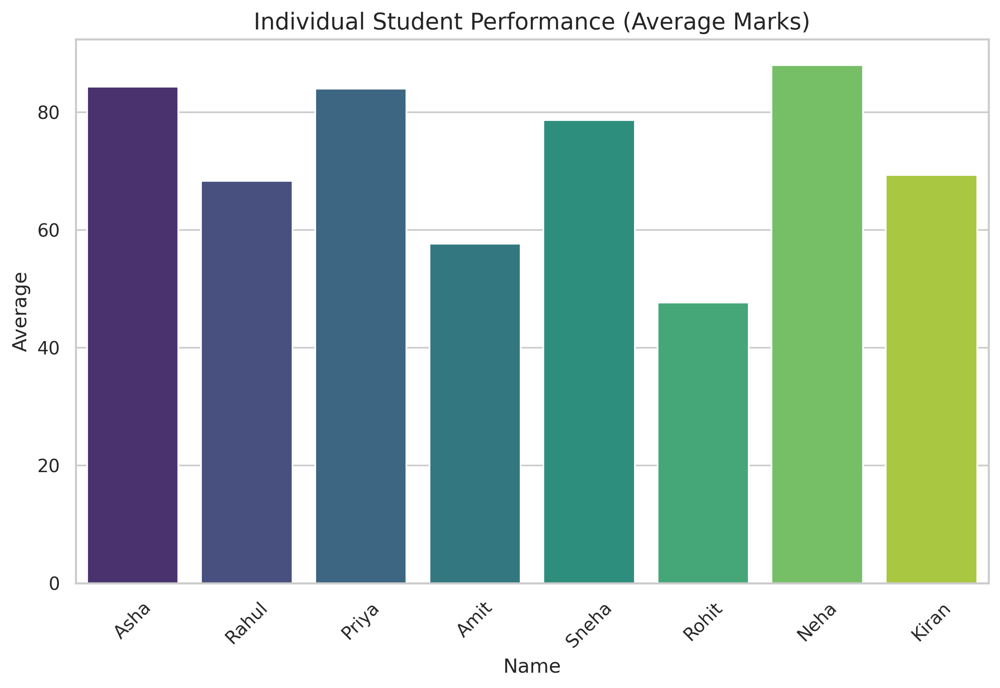
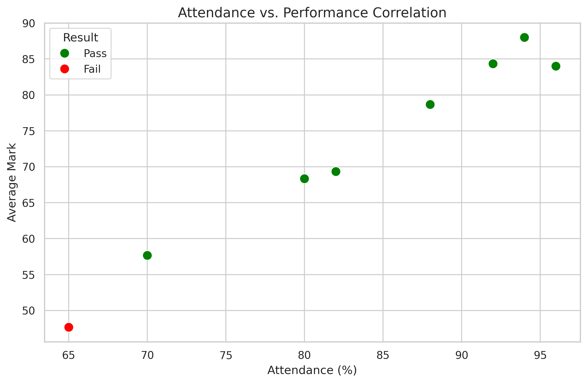
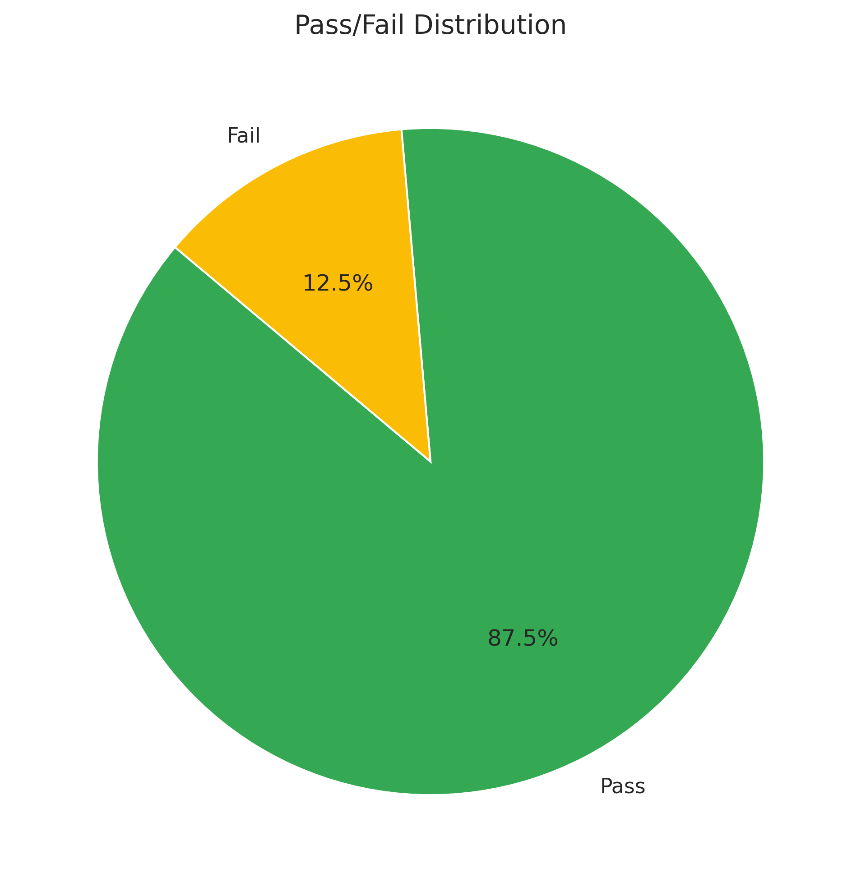
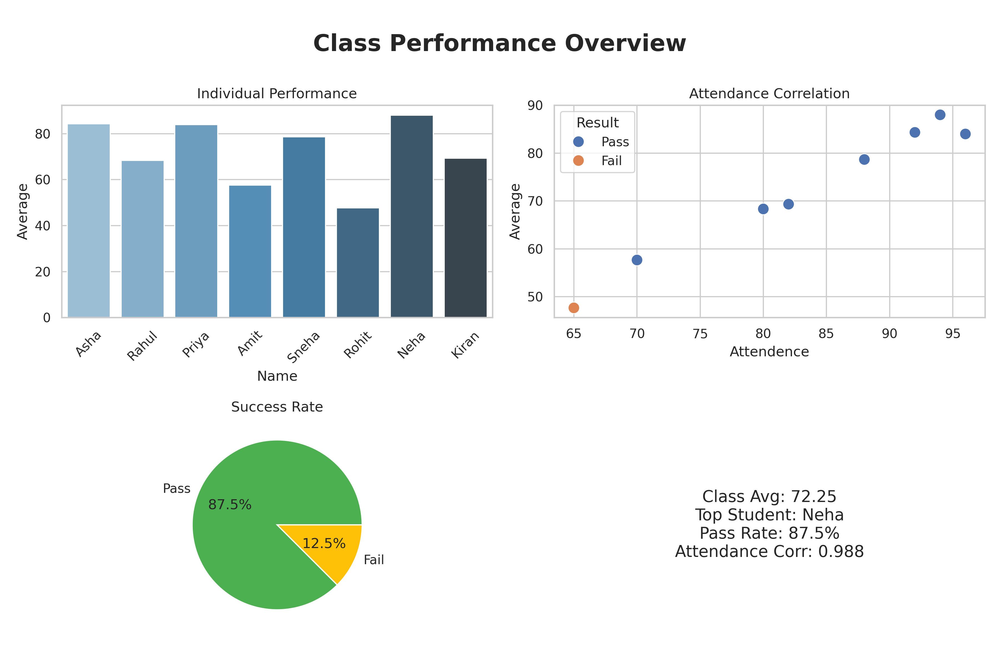

📊 Student Performance Analysis

📌 Project Overview

This project analyzes students' academic performance using Python, Pandas, NumPy, and data visualization techniques.

The analysis focuses on marks, attendance, average performance, and pass/fail status to identify patterns and understand overall class performance.

🎯 Objectives

- Analyze students' academic performance
- Calculate average marks
- Compare individual student performance
- Analyze the relationship between attendance and marks
- Identify highest and lowest performers
- Calculate class average
- Analyze pass/fail distribution
- Create visualizations to present insights

🛠️ Technologies Used

- Python
- Pandas
- NumPy
- Matplotlib
- Jupyter Notebook
- Google Colab

📂 Dataset

The dataset contains:

- Student Name
- Mathematics Marks
- Science Marks
- English Marks
- Attendance Percentage

🔍 Analysis Performed

- Data loading and cleaning
- Exploratory Data Analysis (EDA)
- Average marks calculation
- Student performance comparison
- Attendance vs. performance analysis
- Pass/fail analysis
- Data visualization

## 📊 Visualizations

### Student Performance Summary

### Student Average Marks

### Attendance vs Performance

### Pass/Fail Distribution

### Class Performance Overview

📈 Key Results

- Total Students: 8
- Class Average: 73.2
- Highest Average Score: 91.7
- Pass Rate: 87.5%

💡 Key Insights

- Students with higher attendance generally showed better academic performance.
- The analysis helps identify high-performing and low-performing students.
- Visualizations provide an easy-to-understand overview of class performance.
- The results can help identify students who may need additional academic support.

🚀 How to Run

1. Download or clone this repository.
2. Open "student_performance_analysis.ipynb" in Jupyter Notebook or Google Colab.
3. Install the required libraries:

pip install pandas numpy matplotlib

4. Run the notebook cells to reproduce the analysis and visualizations.

📁 Project Files

- "student_performance_analysis.ipynb" — Main analysis notebook
- "student_data.csv" — Dataset
- "student_performance_summary.png" — Performance summary visualization
- "student_average_marks.png" — Average marks visualization
- "attendance_correlation.png" — Attendance correlation visualization
- "pass_fail_distribution.png" — Pass/fail visualization
- "class_performance_overview.png" — Class performance visualization
- "requirements.txt" — Required Python libraries

👩‍💻 Author

Radhika Mali

Data Science Fresher | Python | Pandas | Data Analysis
